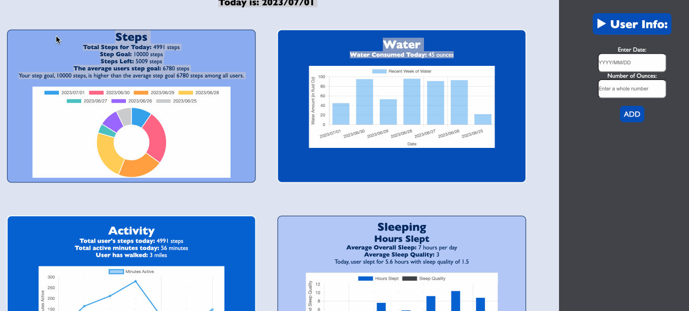

  
# 💪 FitLit 

## 💾 Technologies Used

## 👩‍💻 👩‍💻 👨‍💻 👩‍💻 Collaborators
[Emalee Poellot](https://github.com/em2396)  | 
[Amy Siu](https://github.com/amysiu1028) | 
[Ben Rosner](https://github.com/ben-rosner-williamsburg) | 
[Mary Bruff](https://github.com/MaryBruff)  |  

## 💭 Abstract

FitLit is a wellness companion that transforms the way you track your health journey, merging style and data tracking seamlessly. Its captivating interface and user-friendly design empower you to attain unmatched health and vitality. This innovative app provides a motivating overview of your activities, hydration, and sleep data, igniting your desire for a healthier, happier life.

## 📝  Context
We are a 4 group of front-end developers who worked together remotely via Zoom and asynchronously through the GitHub project board to complete this application. This project was completed from week 2 to week 4 in Mod 2 of the Front End development program at Turing School of Software & Design. 

## 🎥 Preview 

## 🔌 Server Setup
- Fork [this](https://frontend.turing.edu/projects/module-2/fitlit-part-one-agile.html) repository. 
- Clone it to your local machine using the command: `git clone git@github.com:turingschool-examples/fitlit-starter-kit.git`.
- Run the command: `cd fitlit-api`
- Run the command: `npm install`
- Run the command: `npm start`

## Client App Setup
- Clone it to your local machine using the command: `git@github.com:amysiu1028/FitLit.git`
- Run the command: `cd fitlit`
- Run the command: `npm install`
- Run the command: `npm start`

## 📚 Learning Goals
- Use object and array prototype methods to perform data manipulation
- Understand the use of Webpack
- Implement fetch API
- Use Mocha framework with Chai library for TDD
- Create a project that is easily readable with separate files that store functions for DOM manipulation, data model, helper, API calls and scripts
- Collaborate productively and professionally as a team
- Utlizie localStorage to save user data outside of page refresh

## 🥇 Wins
⭐ Successfully integrating charts library into our application.
  
⭐ Developed strong code organization and project management skills using GitHub project boards.

⭐ Collaborated effectively with a team of four, fostering a shared knowledge base to ensure cohesive workflow. This allowed us to maintain a consistent skill level while some team members brought additional   
  expertise, creating a well-balanced team dynamic.
	

## 🚧 Challenges
❗ Getting the hang of understanding code written by others. While also figuring out the flow of async work and checking out pull requests to see what's been done.

❗ Maintaining consistent naming conventions and effectively tracking previously declared names.

❗ Understanding and troubleshooting importing and exporting files with Webpack.
